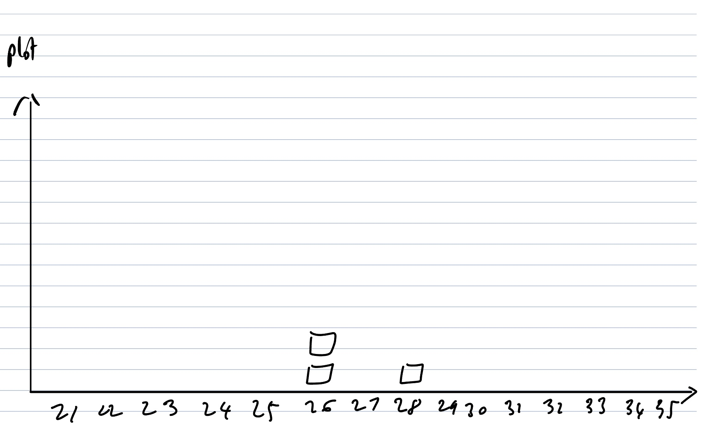
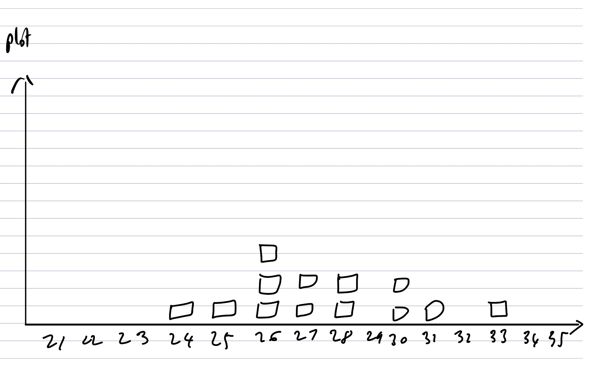
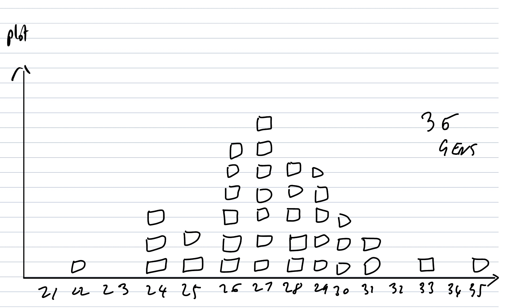
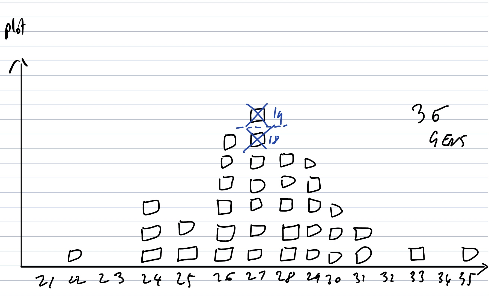
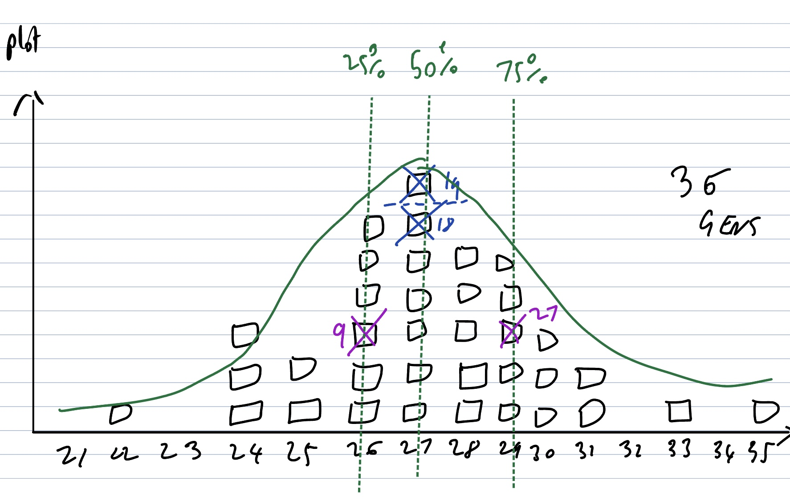

theme: Ostrich, 1

# Probably Right

@garyfleming

^ Talk about probabilistic forecasts and their place in data-lead
estimation.
Last time I did this, I don't think I gave enough background on forecasting
so let's give the talk the peppy start it needs.
Let's talk about dead Russian mathematicians for a while

---

# AA Markov


^ Russian mathematician. 1856.
Tolstoy excommunicated, he requested he be too.
Stochastic processes - seeing order in randomness


---

# Markov Chains

^ Modelling changes through probabilities of one thing following another.
^ Used these in final year dissertation...
^ TODO consider illustrating with the Drunkard's walk first

---

# Example: Weather.

```
SSCRCSRCSRCSCRSSRCSSCR...
```

^ Weather where we are isn't random. It's based on a bunch of factors.
^ Let's simplify: Sunny, cloudy, rainy.

---

# Example: Weather.

```
SSCRCSRCSRCSCRSSRCSSCR...
!!!
 !!!
  !!!
   !!!
```

^ Weather where we are isn't random. It's based on a bunch of factors.
^ Let's simplify: Sunny, cloudy, rainy.

---

```
     S           R           C
  /  |  \     /  |  \     /  |  \
 S   R   C   S   R   C   S   R   C
/|\ /|\ /|\ /|\ /|\ /|\ /|\ /|\ /|\ 
SRC SRC SRC SRC SRC SRC SRC SRC SRC
325  ........
```

Day 1: sunny
Day 2: sunny
THEN 50% cloudy, 30% sun, 20% rain

^ Can use this model of past data to figure out what tomorrow will be given last few days. (EXPLAIN ABOVE)
^ How you present this is up to you. Can just say "cloudy" and be right half the time, pessimistic and say "20% chance of rain", or whatever makes sense.

---

```
S - S - C - C - S - C
|   |   |   |   |   |
S - C - C - R - R - C
|   |   |   |   |   |
S - C - R - C - S - S
```

^ Real world is way more complex. Imagine this grid represents tomorrow's predictions for neighbouring areas. Data and prediction between them is interconnected in fascinating ways.
That 50% of cloudy might be influenced by it's neighbours... who are influenced by it. So we've got this massive feedback loop.
Too complex for this talk, but hinting at reality.

---

# Predicting the Future based on the past!

^ We can make okay predictions based on the past.
^ Not perfect, better than guessing.

---

# Estimates

^ Barely mentioned estimation so far, so let's start tying these ideas together.

---

# Most Estimates Are Waste

^ So why do I say Most estimates are waste. By that, I mean we'd be better off not doing them and using other techniques when we do.
Because other techniques are often better at delivering the same answers more quickly and with more benefits, and better flow.

---

# Why Estimate?

* Figure out capacity
* Is something too big?
* Is something valuable?
* Differences in Understanding?
* Can we get done on time?

^ There are more than this, but it's a pretty good list of reasons people estimate in the first place.
Not bad questions by themselves. We often need at least some of these answers.

---

# Why Estimate?

* Figure out capacity - Slice/Story map
* Is something too big? - Slice/Story map
* Is something valuable? - CD3
* Differences in Understanding? - Cynefin/Slice
* Can we get done on time? - ????

---

# Can we get this done on time?


^ Similar to "when will we deliver this?". Deadlines themselves mostly being made up. Two real deadlines in my career (letters, regulatory).
Can be a fair question, but usually not. Let's assume it is.

---

# Problems with points

* Comparing
* Tracking
* Precision

^ The biggest issue with story points is that they're numbers. And people are used to doing maths with numbers. So they try really hard to do that, despite them being unitless and intentionally relative. (2 + 3 != 5)
^ GO THROUGH THREE BULLETS
^ TODO History of story points here?

---

# Solution

Be relative/Fuzzy
T-shirt sizing: SML

---

# Imagine a sprint...

SS MMM LL

## "We need a date"

S = 2, M = 4, L = 8

SS MMM LL
22 444 88  -> 32


^ Rough categorisation of SML based on past data.
^ Do you trust it? In 32 days exactly this will be delived?
^ Too precise! How to solve?

---

# RANGES!

S = 1-2, M = 3-5, L = 5-8

How do we add ranges to figure out our end date?

^ Go back to past data and create range
^ Will explain later how to get range data

---

# IDEA 1: Add Lowest

SS MMM LL
11 333 55   -> 21

^ Confidence?

---

# IDEA 2: Add highest

SS MMM LL
22 555 88   -> 35

^ Confidence?
^ Between 21 and 35 days, with no knowledge of what's most likely.
^ Poor. Only gets worse as you add more stories.

---

# IDEA 3: Monte Carlo

```
   1  2  3  4  5  6
  ___________________
S| 1  1  1  2  2  2
M| 3  3  4  4  5  5
L| 5  6  6  7  7  8
```


^ When the value of something can be any part of a range, and we can use data to guess how likely each part of a range is, we can use a Monte Carlo simulation to figure out the answer.

---

# IDEA 3: Monte Carlo

```
   1  2  3  4  5  6
  ___________________
S| 1  1  1  2  2  2
M| 3  3  4  4  5  5
L| 5  6  6  7  7  8
```

SS MMM LL

^ Reality: RNG that maps against data distribution
^ Simpler: A dice.
^ For each story, roll a dice. Use lookup table. Record result. Repeat.

---

# IDEA 3: Monte Carlo

```
   1  2  3  4  5  6
  ___________________
S| 1  1  1  2  2  2
M| 3  3  4  4  5  5
L| 5  6  6  7  7  8
```

SS MMM LL
12 433 67   -> 26
11 535 85   -> 28
11 443 67   -> 26
...

^ EXPLAIN. Get a computer to do this *thousands of times*

---



---



---



---



^ Mid point. More likely to succeed than fail

---



^ Confidence intervals
^ "Changes we'll make day 24?" Pretty low.

---

# Probabilistic Forecasting.

^ We get all of the above numbers from real data.

---

# Thank You


@garyfleming
